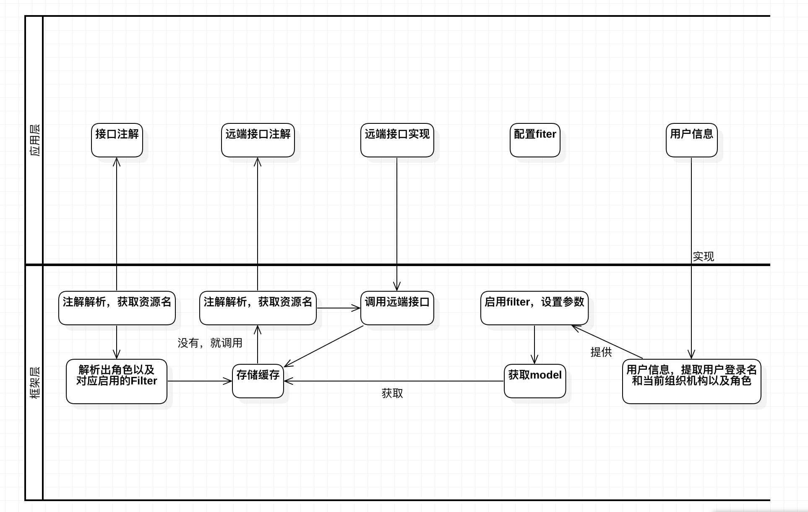

# greenshuttle-identityaccess
IAM for common platform

### 1. Authentication

+ Code grant authorize with hydra
+ SPA with code grant
+ Login and Consent UI for hydra
+ TLS support
+ SSO flow with multi SPA
+ PKCE with public like APP
+ Multi Identity Provider

### 2. Access Control.

+ Oauth2ResourceServer
+ Zuul Filter/Kong/Treafik/Envoy

### 3. Data Scope

